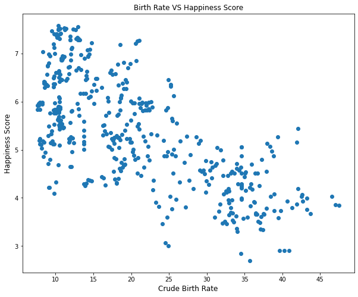

# WORLD HAPPINESS REPORT

## Problem Statement:

We have been hired by the UN to build a model that can predict the happiness of an average person in each country based on scores for 8 categories provided by the UN and an additional 4 factors that we added. Secondly, can we predict what region of the world this average person is from, based on the scores from the features.

## Data Gathering

Data was collected from the UN Happiness Report for the years 2015-2017 [Happiness Report](https://www.kaggle.com/unsdsn/world-happiness)
Data was also gathered from [Our World in Data](https://ourworldindata.org/)

## Data Dictionary

|Feature|Type|Description|
|---|---|---|
|**country**|*object*|Name of the country.|
|**region**|*object*|Region the country belongs to.|
|**year**|*int*|Year of the report.|
|**happiness_score**|*float*|A metric measured by asking the sampled people the question: "How would you rate your happiness on a scale of 1-10"|
|**economy_(gdp_per_capita)**|*float*|The extent to which GDP contributes to the calculation of the Happiness Score.|
|**family**|*float*|The extent to which Family contributes to the calculation of the Happiness Score.|
|**health_(life_expectancy)**|*float*|The extent to which Life expectancy contributed to the calculation of the Happiness Score.|
|**freedom**|*float*|The extent to which Freedom contributed to the calculation of the Happiness Score.|
|**trust_(government_corruption)**|*float*|The extent to which Perception of Corruption contributes to Happiness Score.|
|**generosity**|*float*|The extent to which Generosity contributed to the calculation of the Happiness Score.|
|**dystopia_residual**|*float*|Dystopia is the worst possible country based on the lowest score for each category. The residual is the difference between a specific countries score and the dystopia score. Example: A residual of 0 would reflect being equal to the worst country.|
|**food_supply_(kcal/capita/day)**|*float*|The number of calories available per capita per day for each country.|
|**crude_birth_rate_(births_per_1,000_population)**|*float*|Birth rate per 1,000 people in each country.|
|**deaths_unsafe_water_source_per_100k_people**|*float*|Deaths due to unsafe drinking water per 100,000 people in each country.|
|**deaths_conflict_and_terrorism**|*float*|Total deaths from conflict terrorism a country occured within each country.|

## Data Cleaning

- The UN data was clean, nothing needed to be changed.
- For the data from Our World in Data, there were a few NaN values, for which we imputed the mean value for the region that the country was located in.

## EDA

The first thing that we explored was the relationship between happiness, food, and freedom. Using Tableau, we created a visualization to help show how these features relate to each other. [Tableau](https://public.tableau.com/app/profile/spencer.buckner/viz/HappinessData_16396021350410/Dash1) 

Secondly, we created a heatmap that displays the correlation between happiness and all other features. Then, we created a table to show the average happiness score by region, countries, and also by the year. 

We checked the top 10 average scores by country: 

We checked the bottom 10 scores by country:

Next, we wanted to look at the relationship between the economy of a country and the happiness score: 

(Place holder for Robb's EDA)

## Models

For this project we chose to do two separate paths of model creation. The first path was to use different regressors in order to predict the happiness score based on 13 of the features. The second path was to do multi-classifier models to predict the region. 

### Linear Regression

The first model that we explored was a Multivariate Regression Model. In finding what features we wanted to select, we thoughtthat using 2 feature engineered features could provide some insight into our model.

For our first feature, we multiplied the economy_(gdp_per_capita) by food_supply_(kcal/capita/day) for each respective country. Our second feature was created by multiplying the health_(life_expectancy) by family score for each respective country as well. Once we had our new features, we ran a Linear Regression and produced the following model:

Our model produced an R2 score of ~ 0.72. Not exactly amazing, but a good starting point for our regression models.

Our linear regression model with Polynomial features and Lasso features performed both well with an accuracy score of 0.9999. We also got 0.98 after adding PCA. We also discovered that food supply had the highest coefficient score after regularizing using Lasso.

(Place Holder for NN Regressor)

### Multi-Classification

As we move from Regression towards classification, we have two schools of thought when it comes to model selection. We will first work on 3 supervised models (KNN, Logistic Regression, Random Forest), compare those findings in a confusion matrix and classification report, and then create a model stack with all three (Second level will be the model with the greatest accuracy). Once we have that finished, we will then investigate whether a Neural Network Classifier can produce a better model.

As we compare accuracies, keep in mind that our baseline will be the region representing the most total countries (Sub-Saharan Africa). This region represents roughly 25% of all countries in this dataset.

**Disclaimer**: Due to Regions North America and Australia/New Zealand only having two countries in each, the precision/recall/f1/accuracy metrics are slightly skewed since there is not enough data to group into separate buckets for train/test splitting. Regions with higher country count provide a greater account into how well model performs overall.

Let’s start with KNN

#### KNN Model

INSERT KNN CONFUSION MATRIX      INSERT KNN CLASSIFICATION REPORT

Our KNN model did not perform that great. We achieved a total accuracy score of ~71%, and it was not able to correctly predict any country correct from North America or Australia/New Zealand. The model had a hard time disassociating between Middle East/Northern Africa and Central/Eastern Europe. The model also had trouble with Central and Eastern Europe and Latin America and Caribbean. KNN produced better than our baseline accuracy (25%), but still has more room to improve upon to become competitive.

As we move to our next model lets look at Logistic Regression

#### Logistic Regression:

INSERT LOG REG CONFUSION MATRIX      CLASSIFICATION REPORT

Our Logistic Regression model provided a better picture into our data with a better accuracy score of ~75%. Most of the larger errors were grouped towards Central and Eastern Europe countries being misclassified as Latin America and Caribbean/Western Europe/Middle East and Northern Africa. The only other interesting error was that 3 countries in Sub-Saharan Africa were all classified as Southern Asia.

Our final model in this set of three will be a Random Forest

#### Random Forest:

INSERT RF CONFUSION MATRIX       CLASSIFICATION REPORT

Our Random Forests produced our best model yet with an accuracy score of ~92%. Most errors are gone now, and while some do remain, they are concentrated towards the same errors as the Log Reg model above with Central and Eastern Europe countries being misclassified. Something to take note of here is that 3 of those 10 regions had 100% precision and recall scores by classifying them all correctly (Southern Asia, Eastern Asia, and Australia/New Zealand).

We also wanted to create a model stack of all 3 models as our initial level 1, with a Random Forest as our second level since that produced the highest accuracy score of our 3 classification models so far.

#### Model Stack

 INSERT MODEL STACK CONFUSION MATRIX        CLASSIFICATION REPORT

Our model stack did not produce better results that our random forest and resulted in an accuracy score of ~90%. There are some minor differences and compared to our Random Forest from above, only produced 2 perfect regions (Eastern Asia and Australia/New Zealand).

#### NN Multi-Classifier

Robb's

## Conclusion

