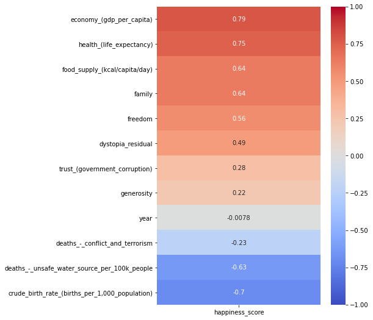
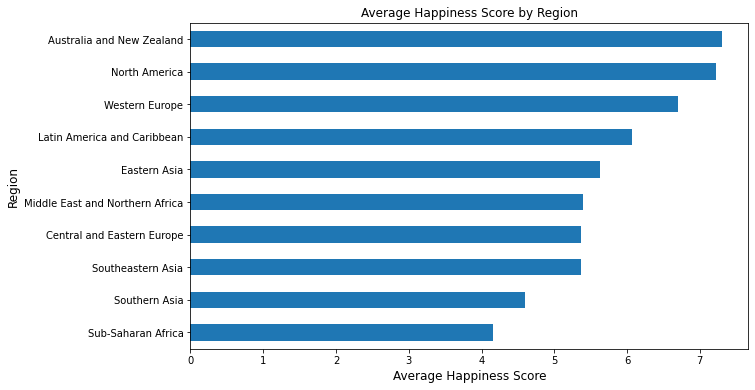
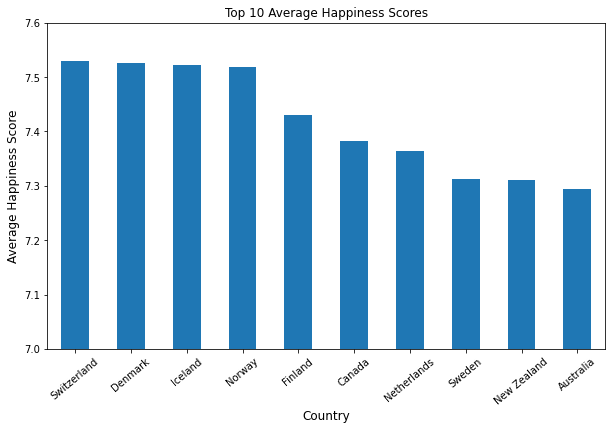
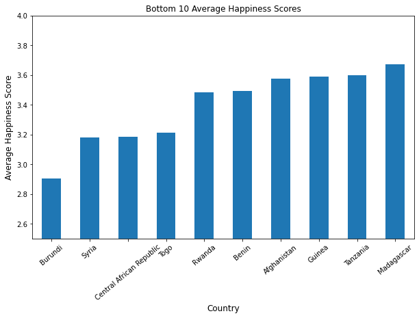
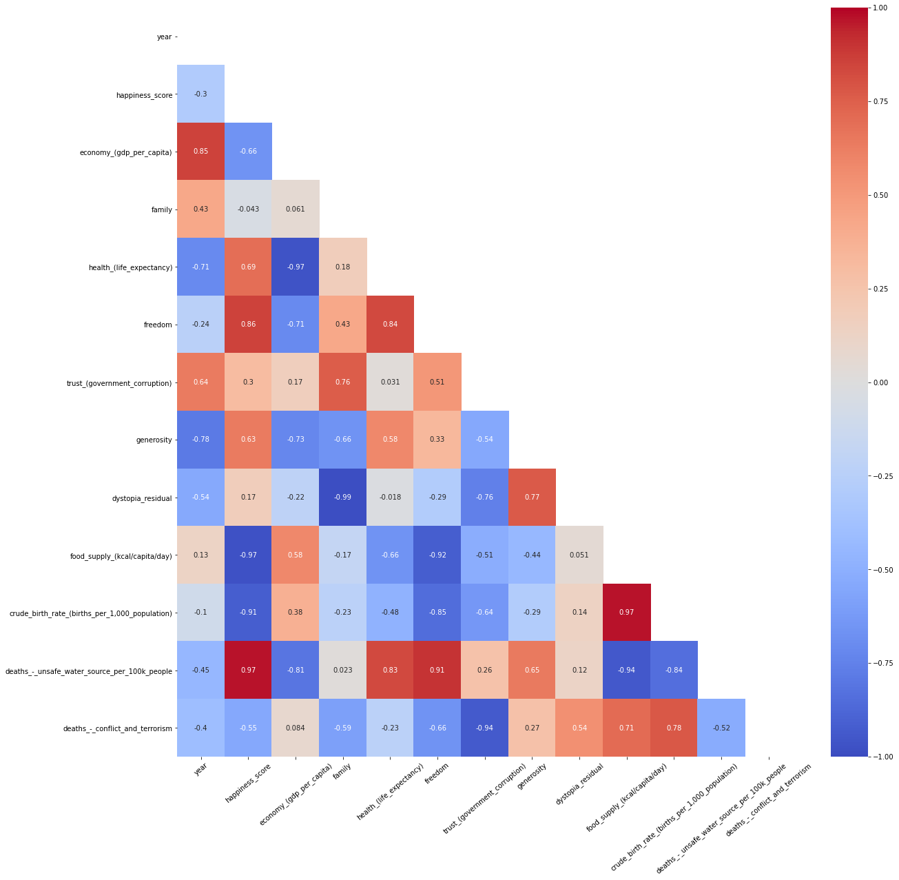
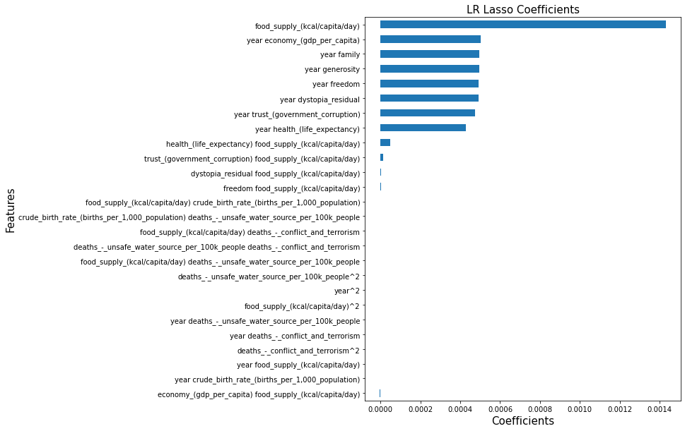

# UN World Happiness Analysis

## Problem Statement:

We have been hired by the UN to build a model that can predict the happiness of an average person in each country based on scores for 8 categories provided by the UN and an additional 4 factors that we added. Secondly, can we predict what region of the world this average person is from, based on the scores from the features.

## Data Gathering

Data was collected from the UN Happiness Report for the years 2015-2017 [Happiness Report](https://www.kaggle.com/unsdsn/world-happiness)

Data was also sourced from [Our World in Data](https://ourworldindata.org/)

## Data Dictionary

|Feature|Type|Description|
|---|---|---|
|**country**|*object*|Name of the country.|
|**region**|*object*|Region the country belongs to.|
|**year**|*int*|Year of the report.|
|**happiness_score**|*float*|A metric measured by asking the sampled people the question: "How would you rate your happiness on a scale of 1-10"|
|**economy_(gdp_per_capita)**|*float*|The extent to which GDP contributes to the calculation of the Happiness Score.|
|**family**|*float*|The extent to which Family contributes to the calculation of the Happiness Score.|
|**health_(life_expectancy)**|*float*|The extent to which Life expectancy contributed to the calculation of the Happiness Score.|
|**freedom**|*float*|The extent to which Freedom contributed to the calculation of the Happiness Score.|
|**trust_(government_corruption)**|*float*|The extent to which Perception of Corruption contributes to Happiness Score.|
|**generosity**|*float*|The extent to which Generosity contributed to the calculation of the Happiness Score.|
|**dystopia_residual**|*float*|Dystopia is the worst possible country based on the lowest score for each category. The residual is the difference between a specific countries score and the dystopia score. Example: A residual of 0 would reflect being equal to the worst country.|
|**food_supply_(kcal/capita/day)**|*float*|The number of calories available per capita per day for each country.|
|**crude_birth_rate_(births_per_1,000_population)**|*float*|Birth rate per 1,000 people in each country.|
|**deaths_unsafe_water_source_per_100k_people**|*float*|Deaths due to unsafe drinking water per 100,000 people in each country.|
|**deaths_conflict_and_terrorism**|*float*|Total deaths from conflict terrorism a country occured within each country.|

## Data Cleaning

- The UN data was clean, nothing needed to be changed.
- For the data from Our World in Data, there were a few NaN values, for which we imputed the mean value for the region that the country was located in.

## EDA

The first thing that we explored was the relationship between happiness, food, and freedom. Using Tableau, we created a visualization to help show how these features relate to each other. [Tableau Visualization](https://public.tableau.com/app/profile/spencer.buckner/viz/HappinessData_16396021350410/HappinessScoresDashboard) 

As we explored further, we created at a heatmap of all the variables to gain an understanding of what produced high correlations to happiness score:

We then wanted to creat the following table to show the average happiness scores by region:

The highest scores all seemed to be centered around North America, Austrailia/New Zealand and Western Europe while the lowest scores were centered around Africa and Asia.

Below is our findings for the top 10 scores: 

We then also checked the bottom 10 scores:

Next, we wanted to look at the relationship between the economy of a country and also the birth rate of a country to the happiness score: 

What we found was very interesting. Both seemes to have relatively strong opposite directions. For Economy, as the GDP per capita increased, the amount of happiness increased. While as the birth rate increased, the total happiness decreased.

We also then wanted to look at each region individually. We created dataframes for each region and then created heatmaps for each region. The heatmaps showed that each region had different correlations between the different features and the happiness score, which makes intuitive sense, assuming that people in different regions of the world view happiness differently. There were three regions that show these distinctions most clearly:

**North America**:

**Sub-Saharan Africa**:

**Southeast Asia**:

We lastly wanted to check the principle component scores for the different features to see which ones had the highest explained variance within the model. We found that the first principle component could account for roughly 50% of the explained variance:

It also appeared that deaths from unsafe water and crude birthrate had the most influence on the first principle component:

After completing the EDA, it was time to start building the models.

## Models

For this project we chose to do two separate paths of model creation. The first path was to use different regressors in order to predict the happiness score based on 13 of the features. The second path was to do multi-classifier models to predict the region. 

### Linear Regression

#### Multivariate Regression Model (MLR)

The first model that we explored was a Multivariate Regression Model. In finding what features we wanted to select, we thought that using 2 feature engineered features could provide some insight into our model.

For our first feature, we multiplied the economy_(gdp_per_capita) by food_supply_(kcal/capita/day) for each respective country. Our second feature was created by multiplying the health_(life_expectancy) by family score for each respective country as well. Once we had our new features, we ran a Linear Regression and produced the following model:

Our model produced an R2 score of ~ 0.72. Not exactly amazing, but a good starting point for our regression models.

#### MLR with Polynomial Features

Our second mlr model with Polynomial features and Lasso regularization performed well with an R2 score of 0.9999. Our PCA achieved 0.98. Our initial though was that we had accidentally leaked the 'answers' to the model and that was why it had achieved such a high score. After careful discussion, we came to the conclusion that since all features affecting these happiness scores are provided by the UN and there are no unknown factors affecting these scores, the models were able to pick up on this and build accurate predictions based on known features. Interestingly enough though, when we ran our Lasso model through, one of our outside data sources (food supply calories) became our highest coefficient in prediciting happiness scores, more than doubling the next closest coefficient. 

Below are the model coefficients for our Lasso:

#### MLR using Neural Networks

After building the model with polynomial features, we wanted to see if a neural network could match the R2 score from the previous models. We used the same polynomial features from the last model, then built a Sequential NN model. We also utilized GridSearch to find the best parameters for the sequential model, and eventually ended up with two hidden layers that contained 128 neurons each, along with two dropout phases (dropout percentage of 25%). This model produced an R2 score of .95, worse off than the MLR Models mentioned above. We then checked this model against the MLR to see where the predictions are different:

We also wanted to visualize how the model performed on the training data vs. the test data:

We decided that since the neural network could not out perform the other model, it was time to move onto the classification models.

### Multi-Classification

As we move from Regression towards classification, we have two schools of thought when it comes to model selection. We will first work on 3 supervised models (KNN, Logistic Regression, Random Forest), compare those findings in a confusion matrix and classification report, and then create a model stack with all three (Second level will be the model with the greatest accuracy). Once we have that finished, we will then investigate whether a Neural Network Classifier can produce a better model.

As we compare accuracy, keep in mind that our baseline accuracy will be the region representing the most total countries (Sub-Saharan Africa). This region represents roughly **25%** of all countries in this data set.

**Disclaimer**: Due to Regions North America and Australia/New Zealand only having two countries in each, the precision/recall/f1/accuracy metrics are slightly skewed since there is not enough data to group into separate buckets for train/test splitting. Regions with higher country count provide greater insight into how well model performs overall.

Let’s start with KNN.

#### KNN Model

     

Our KNN model did not perform that great. We achieved a total accuracy score of ~71%, and it was not able to correctly predict any country correct from North America or Australia/New Zealand. The model had a hard time disassociating between Middle East/Northern Africa and Central/Eastern Europe. The model also had trouble with Central and Eastern Europe and Latin America and Caribbean. KNN produced better than our baseline accuracy (25%), but still has more room to improve upon to become competitive.

As we move to our next model lets look at Logistic Regression.

#### Logistic Regression:

      

Our Logistic Regression model provided a better picture into our data with a better accuracy score of ~75%. Most of the larger errors were grouped towards Central and Eastern Europe countries being misclassified as Latin America and Caribbean/Western Europe/Middle East and Northern Africa. The only other interesting error was that 3 countries in Sub-Saharan Africa were all classified as Southern Asia.

Our final model in this set of three will be a Random Forest.

#### Random Forest:

      

Our Random Forests produced our best model yet with an accuracy score of ~92%. Most errors are gone now, and while some do remain, they are concentrated towards the same errors as the Log Reg model above with Central and Eastern Europe countries being misclassified. Something to take note of here is that 3 of those 10 regions had 100% precision and recall scores by classifying them all correctly (Southern Asia, Eastern Asia, and Australia/New Zealand).

We also wanted to create a model stack of all 3 models as our initial level 1, with a Random Forest as our second level since that produced the highest accuracy score of our 3 classification models so far.

#### Model Stack

       

Our model stack did not produce better results that our random forest and resulted in an accuracy score of ~90%. There are some minor differences and compared to our Random Forest from above, only produced 2 perfect regions (Eastern Asia and Australia/New Zealand).

#### NN Multi-Classifier

Our neural network multi-classifier was built with two hidden layers, each with 128 neurons, and two dropout layers, each with a 25% dropout rate. This model had an accuracy score of 85%, well under the best random forest model. The confusion matrix showed that the model did not perfectly predicted any of the regions. 

## Conclusion

### Regression Models

Since all of the features were known and that there were no unknown variables that would affect happiness from the UN data, our polynomial model produced the highest R2 score (0.999). When reducing features with a Lasso, we were able to reduce down from 90 to 27 features. We also discovered that the most important coefficient was the food calorie supply, which was not information supplied by the UN but rather sourced from a 3rd party. It was interesting that the neural network performed worse than the Multiple Linear Regression, even though the Neural Network was also given the exact same data for prediction. We believe that this is likely due to the fact that this is a relatively small data set, and neural networks were designed to handle larger data problems. If we were to add more years, and more relevant data, we believe it is likely that the Neural Network would match the effectiveness of the Multiple Linear Regression model.

### Classification Models

The worst model found was the KNN with 71% accuracy, followed by the Logistic Regression with an accuracy of 75%. The best model we found was Random Forest with an accuracy score of 92%, which suprisingly was better than the stacked model. The random forest was able to perfectly predict 3 of the regions with 100% precision and recall scores. All models struggled to predict Central and Eastern Europe countries with the final Random Forest faring the best. The Neural Network was again out performed by the simpler models, and again we believe this is due to a smaller data set. It should noted that all models out performed the baseline accuracy, which was 25%. 

